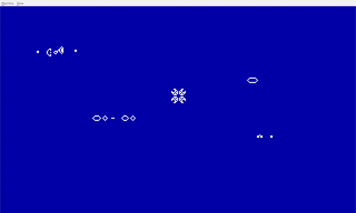

# game-of-life-x86



This repository contains a bare-metal [Conway's game of life](https://en.wikipedia.org/wiki/Conway%27s_Game_of_Life) simulator written as an [MBR bootstrap program](https://wiki.osdev.org/MBR_(x86)).

I built this project to brush up on my assembly skills and learn more about the x86 boot protocol.

The program asks the BIOS to set up VGA Mode 13h (320x200, 256 colors) and then draws frames by writing directly to the video framebuffer at `0xA000`. This requires a VGA-compatible display, you cannot run the program on a headless system or a serial-only console.

## The Constraints

Building software within a boot sector brought several challenges:

* The CPU wakes up in [Real Mode](https://wiki.osdev.org/Real_Mode). Memory addressing is done through [segmentation](https://wiki.osdev.org/Segmentation), using 16-bit segments and offsets, which limits total accessible physical memory to 1MB.
* The entire simulation logic, seed parsing, double-buffering, and rendering must fit into 510 bytes of machine code, since the last two bytes need to be the boot signature (`0xAA55`).

## Double buffering

An MBR is loaded by the BIOS at physical address `0x7C00`. It is limited to a 512 byte sector, so the space after it (starting with address `0x7E00`) is free.

In order to have a proper image, the frame buffers couldn't fit inside the small 512 byte region, so I decided that's going to be the area where I store the two buffers for the current and next frame. Each one of them describes a 256x128 frame, so they consume 64kb in total, from `0x7E00` to `0x17E00`.

## Seeding

Initially the frame buffers are filled with 0s. I set up the initial state by parsing the seed and setting the corresponding byte in the current frame buffer to 1 (alive).

The seed file can be user-defined. Its format is described in [this section](#adding-custom-patterns).

## Simulation logic

The rules of this game are as follows:

1. Any live cell with fewer than two live neighbours dies, as if by underpopulation.
1. Any live cell with two or three live neighbours lives on to the next generation.
1. Any live cell with more than three live neighbours dies, as if by overpopulation.
1. Any dead cell with exactly three live neighbours becomes a live cell, as if by reproduction.

They can be simplified. If I count all the live cells in a 3x3 area including the cell itself, the rules reduce to three conditions:

1. Sum is 3: The cell becomes or stays alive.
1. Sum is 4: The cell keeps its current state.
1. Any other sum: The cell dies.

## Getting started

### Requirements
In order to build and run this application, the following packages are required:

- `build-essential` (includes `make`)
- `nasm`
- `qemu-system-x86`

### Building and Running

Run with the default seed pattern:
```bash
make run
```

Run with a custom pattern:
```bash
make SEED=pulsar run
```

To find out other available patterns, run:
```bash
make seeds
```

### Adding custom patterns

You can add a custom pattern by writing your own include file (`some_pattern.inc`), putting it in `patterns/` and building the binary with `make SEED=some_pattern`. The format consists of pixel coordinates plus the bytes marking the end of the array. Since the effective rendering window is 256x128, keep `x` between 0 and 255 and `y` between 0 and 127.

```
.seed_data:
    db x0, y0, x1, y1, ...

    ; end bytes
    dw 0xFFFF
```

It's very tedious, but finding a better way to do it is outside the scope of this project.